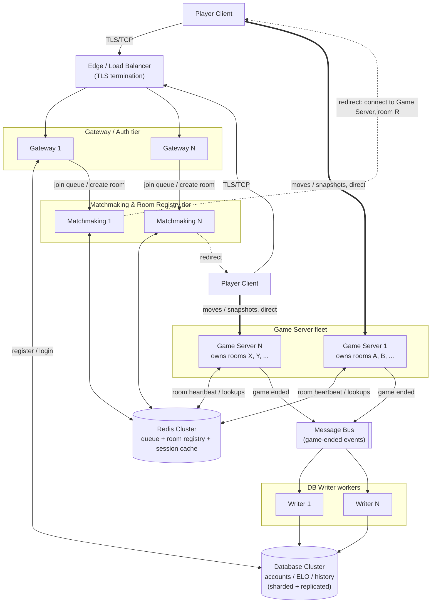

# Kung Fu Chess — Server-Side Cloud Design

This document proposes an infrastructure architecture to run Kung Fu Chess at:

- **100,000,000** registered user accounts
- **10,000,000** concurrent players, worldwide
- Real-time gameplay, average game length **30–90 seconds**

It is a system/infrastructure design, not a code design. Every server type below is a
**process running in its own Docker container** (per the stated assumptions), and the
database is treated as **one logical server** even though it is a cluster internally.

All throughput numbers are order-of-magnitude planning estimates (standard queueing-theory
reasoning + reasonable protocol-overhead assumptions), meant to size the architecture
directionally. They should be validated with real load tests before being treated as SLAs —
but they are real calculations, not guesses pulled from thin air, and every one of them is
shown below.

## Grounding: what the actual game logic requires

The proposal below is shaped by how this repository's game logic actually works today,
not an abstract chess server:

- A game is **exactly two players in one room** (`server/services/room_service.py`'s
  `RoomService`: `MAX_PLAYERS = 2`; `RoomStatus` goes `WAITING_FOR_PLAYERS → READY →
  IN_PROGRESS`).
- Matching players by rating is a **queue + pairing** problem (`matchmaking_service.py`'s
  `MatchmakingService`: an ELO-windowed FIFO queue, widening the accepted rating gap the
  longer a player waits) — today this queue lives in one process's memory.
- The actual game is a **real-time simulation with its own clock**, not a
  request/response turn engine: `engine.game.GameEngine` + `engine.game_state.GameState`
  hold the live board, pending moves, and per-cell cooldowns in memory; a move is
  *validated and queued*, then *resolved* on a fixed tick (`server/network/server.py`'s
  `NetworkServer` currently ticks every **30 ms**, i.e. ~33.3 Hz — `TICK_INTERVAL_S = 0.03`).
  A piece that just landed enters a **cooldown** (`shared.constants.COOLDOWN_DURATION`,
  1000 ms) before it can move again.
- `server.game.real_time_arbiter.RealTimeArbiter` is the per-room orchestrator: one
  instance wraps one `GameEngine`/`GameState` and owns that room's simulation end to end.
  Nothing about it is shareable across processes — it is designed to be one room, one
  process, in memory.
- Every tick, the current implementation broadcasts a **full board snapshot**
  (`GameStateUpdateMessage`) to both players in the room, regardless of whether anything
  actually moved (`_RoomBroadcastObserver` fires on *every* engine event, and `tick()`
  always fires a `TimeAdvancedEvent`). This detail matters a lot for the traffic
  calculation in §3.
- Accounts, password hashes, and ELO already live in a real relational schema
  (`server/database/sqlite_db_manager.py`: `users`, `game_history` tables) — today backed
  by SQLite, which is exactly the choice §1 has to replace.

Because a room's simulation is single-process by construction, **the natural unit of
horizontal scaling is the room**, not the player. The whole design below follows from
that one fact.

---

## 1. Database choice — would SQLite work at 100M users?

**No.** Not primarily because of data volume — because of its concurrency and access model.

**Storage size is not the problem.** 100M user rows at roughly 300 bytes/row (username,
a ~60-byte bcrypt hash, an integer ELO, timestamps, index overhead) is only:

```
100,000,000 × 300 B ≈ 30 GB
```

SQLite can physically hold that. The problems are structural:

1. **SQLite is an embedded, single-file, single-writer database.** Only one process may
   hold the write lock at a time; every other writer blocks. This repo's own
   `sqlite_db_manager.py` even documents opening a fresh connection per call for exactly
   this reason. At our scale we have hundreds of Gateway containers and hundreds to
   thousands of Game Server containers (§2) that all need to read/write accounts — SQLite
   has no client/server network protocol at all. Every process would need direct
   filesystem access to one file, which does not work across a fleet of containers, and
   SQLite's own documentation explicitly warns against doing this over a network
   filesystem.
2. **The sustained write rate is far beyond what a single writer can absorb.** Using
   Little's Law (`concurrent = arrival_rate × duration`) on the game numbers we're given:
   5,000,000 concurrent games (10M players ÷ 2) with an average 60-second lifetime implies
   a **game completion rate** of
   ```
   5,000,000 games ÷ 60 s ≈ 83,333 games/second
   ```
   Each completed game needs at least one `game_history` insert plus two ELO updates
   (winner/loser or draw) — call it 3 write operations per game:
   ```
   83,333 × 3 ≈ 250,000 write operations/second, sustained, cluster-wide
   ```
   A single-writer embedded database cannot come close to this regardless of disk speed.
3. **No built-in replication or sharding.** 100M accounts and a durability requirement
   ("don't lose anyone's ELO") need multiple copies of the data and the ability to split
   the write load across machines. SQLite has neither.

**What to use instead:** a **horizontally sharded, replicated relational cluster** —
e.g. PostgreSQL sharded with Citus, or a distributed SQL system such as CockroachDB /
YugabyteDB (Raft-replicated, horizontally scalable, speaks standard SQL). This satisfies
the "DB counts as one server" assumption: from every other server type's point of view it
is one logical endpoint, internally partitioned by `user_id` so that both the 30 GB of
account data and the 250,000 writes/second are spread across many shards instead of one
writer.

One more consequence of the same calculation: if every completed game's row (even
metadata only, ~200 bytes, no move log) were kept forever:
```
83,333 games/s × 86,400 s/day ≈ 7.2 billion games/day
7.2×10^9 × 200 B ≈ 1.44 TB/day
```
That is not an accounts problem, it's a **history/analytics** problem, and it should not
sit in the same hot OLTP tables as login/ELO. §"Server types" below routes it through an
async pipeline into the DB cluster instead of a synchronous write from the game server.

---

## 2. Concurrency & routing — is one server enough for 10M concurrent players?

**No, decisively.** Ignoring CPU/memory limits entirely, a single OS process cannot even
*hold* 10,000,000 simultaneous TCP connections (default file-descriptor limits are in the
tens of thousands; even heavily tuned, a single box tops out several orders of magnitude
below 10M). And this repository's actual real-time loop is CPU-bound per room (a 30 ms
tick per room, per §"Grounding") — a single Python process is bound by the GIL for that
work regardless of connection limits. One server is not a serious option; the system must
be **partitioned by room**.

### How do we know which players are on which server?

We introduce a **Room Registry** — a fast, shared lookup (`room_id → game_server_id`,
`user_id → room_id`) held in a Redis cluster, visible to every server in the fleet. This
is the distributed replacement for the in-process dictionaries `RoomService`/
`MatchmakingService` use today (those only see connections on their own single process —
fine for one process, not for a fleet).

Flow for a player:

1. Client connects to the **Edge/Load Balancer**, which is stateless and routes to any
   healthy **Gateway server**.
2. Gateway authenticates against the DB cluster (`AuthService`'s Register/Login flow,
   unchanged in spirit) and either:
   - looks up an existing `room_id` the player is already in (Room Registry), or
   - enqueues the player into the **global** matchmaking queue / room-create-or-join
     request (Matchmaking service, Redis-backed — not a per-process queue anymore).
3. Once a room is assigned to exactly **one** Game Server instance (rooms cannot be split
   across processes — the whole point of `RealTimeArbiter` owning one `GameEngine` in one
   process), the Room Registry records that mapping, and both matched players are
   **redirected** — told "connect to Game Server G for room R" — rather than having their
   original connection silently proxied through the Gateway. A direct redirect avoids
   doubling every byte of game traffic through an extra hop, which matters a great deal
   once §3's bandwidth numbers are on the table.

### How do we ensure "everyone can play with everyone"?

The critical design point is that the **matchmaking queue and room registry must be
global**, not per-server. If each Game Server ran its own local `MatchmakingService`
(as the current single-process code does), a player connected to server #17 could only
ever be matched against another player also connected to server #17 — the opposite of
"everyone can play with everyone." By keeping the queue and registry in a shared Redis
cluster that every Matchmaking-service instance reads and writes, any two players
anywhere in the fleet can be paired, and the pair is then routed to whichever single Game
Server will host their room.

### Responsibility split

| Tier | Owns |
|---|---|
| Edge / Load Balancer | TLS termination, DDoS absorption, routing to a healthy Gateway |
| Gateway / Auth | Login/Register (against the DB cluster), issuing session identity, submitting matchmaking/room requests |
| Matchmaking & Room Registry | The *global* queue and the *global* `room_id → game_server` map (Redis-backed) |
| Game Server fleet | The actual real-time simulation — one `GameEngine`/`RealTimeArbiter` per room, fully in memory, for that room's ~30–90 s lifetime |
| Database cluster | Durable accounts, ELO, game history |

No tier needs to know about rooms it doesn't own — a Game Server only ever simulates the
rooms assigned to it; it never needs to talk to another Game Server.

---

## 3. Network traffic — how much does "a move every ~2s" actually generate?

**Inbound (moves):** with 10,000,000 concurrent players each moving on average every 2
seconds:
```
10,000,000 ÷ 2 s = 5,000,000 moves/second, cluster-wide
```
A move message (`MovePieceMessage`: two cells + a piece id) is small — call it ~100 bytes
of JSON, plus the 4-byte length header this project's own wire format uses
(`shared/protocol/protocol.py`), plus TCP/IP overhead: ~150 bytes on the wire.
```
5,000,000 × 150 B ≈ 750 MB/s ≈ 6 Gbps, cluster-wide
```
Spread across a fleet of ~1,000 Game Server containers (sized in §"Server types" below),
that's **~6 Mbps of inbound move traffic per container** — trivial. This is *a little*,
by any modern datacenter standard.

**Outbound (state broadcasts) is the real question — and the current implementation's
actual behavior makes it much bigger than the move rate suggests.** As noted in
"Grounding," the game server broadcasts a full board snapshot to both players **every
simulation tick (30 ms / 33.3 Hz), regardless of whether a move happened** — not only when
something changes. A `GameStateUpdateMessage` carries the whole 8×8 board as text; with
JSON overhead call it ~400 bytes of payload, ~500 bytes on the wire.

Naive (current-behavior) cluster-wide outbound bandwidth:
```
5,000,000 rooms × 33.3 broadcasts/s × 2 recipients = 333,333,333 messages/second
333,333,333 × 500 B ≈ 166.7 GB/s ≈ 1.3 Tbps, cluster-wide
```
Per Game Server container (at ~5,000 rooms/container, from §"Server types"):
```
5,000 rooms × 33.3/s × 2 × 500 B ≈ 166.7 MB/s ≈ 1.3 Gbps — on a single container
```

**This is a lot** — over a terabit per second cluster-wide, and more than one gigabit
*per individual container* just for board snapshots nobody asked for. It would be the
dominant cost and the first bottleneck in this design if left as-is.

**Recommended fix, informed directly by this number:** decouple the *simulation* tick
(which must stay at 30 ms — that is what gives cooldowns and mid-flight collisions their
precision) from the *network broadcast* tick, and send diffs instead of full boards. This
is a standard real-time-game networking pattern, not a game-logic change — the server
still simulates at full precision, it just tells clients less often and more compactly:

- Broadcast at **10 Hz** instead of 33.3 Hz (≈3.3× reduction) — comfortably smooth for a
  30–90 s casual match.
- Send only the cells that changed since the last broadcast instead of the whole board
  (typically 0–2 cells per 100 ms window vs. 64) — roughly a 4× payload reduction.

Combined (~13×), that brings the same traffic down to:
```
1.3 Tbps ÷ 13 ≈ 100 Gbps, cluster-wide
≈ 100 Mbps, per Game Server container
```
That is well within what a single modern container's network interface and a datacenter
fabric handle routinely (commercial real-time multiplayer platforms operate in this same
order of magnitude). §"Why this meets the throughput requirement" carries this optimized
number forward.

---

## 4. Game duration (30–90s) — what it implies for the containers

Short games change the failure/scaling calculus in a way that's worth stating explicitly:

- **A Game Server container's state is real but *cheap to lose*.** It must hold its
  assigned rooms' `GameEngine`/`GameState` fully in memory for the room's lifetime (it is
  genuinely stateful — this is not a stateless web server), but that lifetime is bounded
  to **30–90 seconds**. If a container crashes, the blast radius is "however many rooms
  were on that one container, each worth at most ~90 seconds of a casual match" — not
  hours of irreplaceable state. That changes the answer from "we need hot state
  replication for every room" (expensive, complex) to "just drop the affected rooms and
  let those players re-queue" (cheap, simple) — see the Failure Handling table.
- **Rooms churn fast, so container *turnover* is high even though occupancy is stable.**
  The 83,333 games/second computed in §1/§3 is the rate at which rooms are being created
  and destroyed cluster-wide, continuously. This is real, sustained load on the
  Matchmaking/Room-Registry tier (many creates, joins, and cleanups per second) — which is
  exactly why that tier is backed by Redis (built for high-throughput, low-latency
  key/value operations) and not by the durable DB cluster.
- **Game Servers can scale and redeploy aggressively.** Because no single container ever
  holds more than ~90 seconds of state that matters, it can be *drained* (stop accepting
  new rooms, let existing ones finish) and safely terminated within about a minute — ideal
  for autoscaling on load and for fast rolling deploys, unlike a service that has to carry
  long-lived session state.
- **The database only needs to be touched at the edges of a game's life** (on room
  creation, arguably not at all; at minimum once at game end), never mid-game — which is
  what makes it possible to keep the 250,000 writes/second from §1 off the hot path
  entirely (see the Message Bus in the next section).

---

## Proposed architecture

### Server types

| # | Server type | Technology (example) | Stateful? | Instances at target scale | Scales with |
|---|---|---|---|---|---|
| 1 | Edge / Load Balancer | Managed L4/L7 LB, GeoDNS/anycast | No | ~10–20, globally distributed | Total connection rate |
| 2 | Gateway / Auth | Container behind the LB, talks to DB cluster | No (session is a signed token, not held in memory) | ~200 | Login/connect rate |
| 3 | Matchmaking & Room Registry | Container(s) + Redis Cluster | Compute: no. Registry/queue data: yes, in Redis | ~100 compute instances + Redis cluster (dozens of shards, replicated) | Room create/join rate (~83k/s, §4) |
| 4 | Game Server | One process/container, owns `RealTimeArbiter` per room | **Yes**, per room, for ~30–90 s | **~1,000** (10M players ÷ 10,000 players/container) | Concurrent players/rooms |
| 5 | Message Bus | Kafka-like durable log | Yes (replicated log) | ~30 brokers | Game-end event rate (~83k/s) |
| 6 | DB Writer Worker | Consumes the bus, writes to DB cluster | No | ~50 | Game-end write rate |
| 7 | Database Cluster | Sharded/replicated SQL (e.g. CockroachDB or Postgres+Citus) | Yes — but counts as **one logical server** per the stated assumption | Internally: dozens of shards × replicas | Registered users (100M) + write throughput |

The **1,000-Game-Server figure** assumes ~10,000 concurrent players (≈5,000 rooms) per
container before tick-loop CPU jitter becomes a concern for a single-process, 30 ms
real-time loop — a deliberately conservative planning number for a Python/GIL-bound
process; a more concurrency-friendly implementation of the same `RealTimeArbiter` logic
could raise the per-container ceiling and lower this count. Either way, the architecture
scales the same way: add containers. That number should be confirmed with load testing,
not treated as exact — but it is the number this whole document's bandwidth-per-container
math (§3) is built from, so it's stated explicitly rather than left vague.

### Role of each server type

- **Edge / Load Balancer** — the only thing with a public IP. Terminates TLS, absorbs
  volumetric/DDoS traffic, and does nothing stateful — any instance can serve any client.
- **Gateway / Auth** — the front door for account actions: Register/Login
  (`AuthService`'s job today, unchanged conceptually) against the DB cluster, and the
  entry point for "I want to play" requests, which it forwards to Matchmaking. Holds no
  per-player game state.
- **Matchmaking & Room Registry** — owns the *global* view of "who is waiting" and "which
  room lives on which Game Server" (the distributed version of this repo's
  `MatchmakingService`/`RoomService`). Pairs players by ELO (same widening-window
  algorithm already implemented), picks a Game Server to host a new room (e.g.
  least-loaded), and writes the assignment to the Room Registry so Gateways and Game
  Servers can look it up.
- **Game Server fleet** — the actual product. Each instance runs many independent
  `GameEngine`/`RealTimeArbiter` instances, one per room it was assigned, each ticking at
  30 ms, validating and applying moves, and broadcasting state to that room's two
  players. A Game Server never talks to another Game Server — rooms are fully isolated,
  which is exactly what makes this tier horizontally scalable without coordination.
- **Message Bus** — decouples "a game just ended" from "the DB got updated." A Game
  Server publishes one small event per finished game (result, ELO delta inputs, move
  count) and moves on immediately; it never blocks a real-time tick loop on a database
  round trip.
- **DB Writer Workers** — a small stateless pool that consumes the bus and performs the
  actual `game_history` insert + ELO updates, at whatever rate the DB cluster can sustain,
  smoothing out the 83k/s burst instead of hitting the DB with it directly.
- **Database Cluster** — the durable source of truth for accounts, credentials, ELO, and
  game history. Everything upstream treats it as one endpoint, per the assumption; it is
  sharded/replicated internally to meet §1's numbers.

### Communication



- **Client ↔ Gateway:** TLS-wrapped TCP for auth/matchmaking requests. Because this
  traffic needs to pass through standard HTTP-aware load balancers/CDNs easily, WebSocket
  (as this repo's *older* `server/server.py` already uses) is the pragmatic choice here,
  even though it's a thin layer over the same idea as this project's raw-socket protocol.
- **Client ↔ Game Server (post-redirect):** a **direct** connection, not proxied through
  the Gateway — this is deliberate, given §3's bandwidth numbers: proxying would double
  every byte of move/snapshot traffic. This project's existing framed protocol
  (`shared/protocol`: length-prefixed messages, one dataclass per message type) is the
  right shape for this; at this scale it's worth replacing the JSON payload with a compact
  binary encoding (e.g. Protocol Buffers) to shrink the per-message size assumed in §3
  even further.
- **Gateway/Matchmaking ↔ Redis:** the Redis wire protocol (RESP) — low-latency key/value
  and queue operations, not general request/response traffic.
- **Game Server → Message Bus → DB Writers → DB:** asynchronous, at game-end only. The
  real-time hot path (moves, ticks, broadcasts) never talks to the database directly.
- All server-to-server traffic stays inside a private network (VPC), authenticated
  service-to-service (mTLS); only the Edge tier is internet-facing.

### Failure handling

| Server type | If an instance goes down | Recovery |
|---|---|---|
| Edge / LB | Invisible to users — redundant instances absorb the traffic | Orchestrator replaces it; no state to restore |
| Gateway / Auth | In-flight requests fail; client retries | Stateless — any other Gateway instance serves the retry immediately |
| Matchmaking & Room Registry (compute) | Queued requests on that instance are lost | Client retries via LB to a different instance; durable queue/registry state lives in Redis, not this tier |
| Redis Cluster | One shard's primary fails | Automatic failover to a replica (Redis Cluster/Sentinel); brief (~seconds) write pause on that shard only. Worst case: an in-flight match is dropped and both players are simply re-queued — cheap, because matchmaking data isn't durable-critical |
| Game Server | All rooms hosted on that container are lost | Per §4: bounded loss (≤90 s of casual gameplay per affected room). Orchestrator removes/replaces the container; affected clients detect the disconnect and are routed back through Matchmaking to re-queue. No hot standby needed per room |
| Message Bus | A broker fails | Replicated log (e.g. Kafka replication factor 3) — no event is lost; consumers resume from the last committed offset |
| DB Writer Worker | Crashes mid-processing | The bus does not consider the message acknowledged until the write commits, so it's redelivered to another worker — no game result is lost |
| Database Cluster | One shard's primary fails | Automatic failover to a replica (built into CockroachDB/Citus-style clusters); only that shard's users (≈100M ÷ shard-count) are briefly affected, not the whole user base |

### Why this meets the throughput requirement

Tying directly back to §3's numbers:

- **Inbound moves (~6 Gbps cluster-wide, ~6 Mbps per Game Server container)** are trivial
  for any container's network interface and for a datacenter fabric built for orders of
  magnitude more — not a bottleneck at any tier.
- **Outbound state (the actual risk)** is explicitly *not* left at the naive ~1.3 Tbps
  figure — the design calls for decoupling the network broadcast rate (10 Hz) from the
  30 ms simulation tick and sending diffs instead of full boards, bringing it to
  **~100 Gbps cluster-wide / ~100 Mbps per container**, the same order of magnitude
  commercial real-time multiplayer platforms already run at.
- **The database write burst (~250,000 writes/s at game-end)** never reaches the DB
  cluster directly — it's absorbed by the Message Bus and smoothed out by a horizontally
  scaled pool of DB Writer Workers, so the DB cluster only ever sees a write rate its
  shard count was provisioned for, not an unpredictable spike.
- **No cross-Game-Server coordination exists on the hot path.** Because each room is
  owned by exactly one process (matching how `RealTimeArbiter`/`GameEngine` already work),
  processing a move never requires talking to another Game Server, another shard, or the
  database — it's a fully local, in-memory operation. The *only* place cross-server
  coordination happens is matchmaking/room-assignment, which runs at the much lower
  ~83,000/s game-*start* rate against Redis — a system built for millions of ops/second.
- **Every stateful tier is sharded** (Game Servers by room, the DB by user, Redis by key)
  so the system scales by adding more shards/containers, not by making any single
  component bigger — there is no component in this design that must grow without bound as
  registered users or concurrent players grow.
