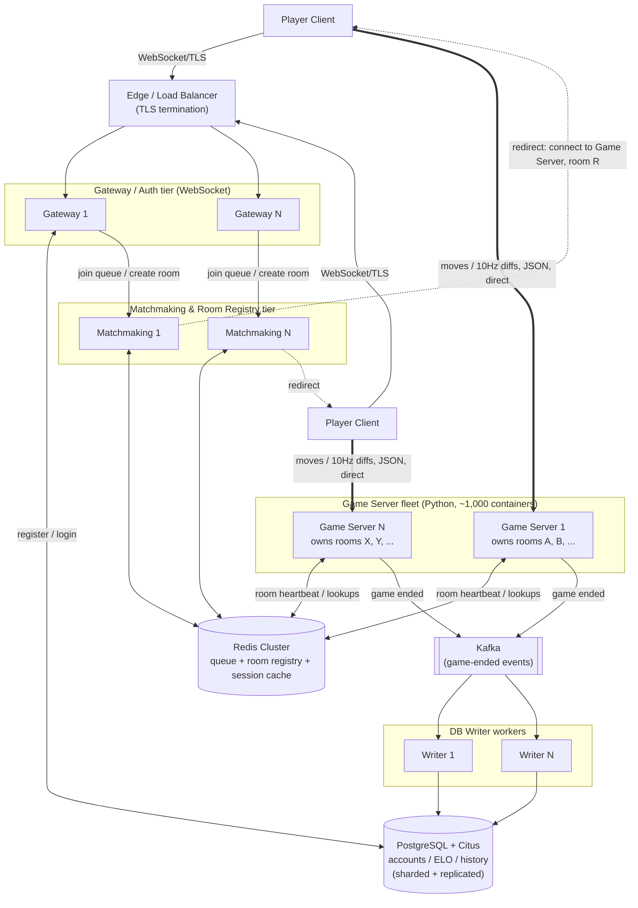

# Kung Fu Chess — Server Architecture

This is the decided architecture — every open question has been resolved to one concrete
choice. Each section below states the decision and explains why, grounded in real
calculations against the target scale, not a menu of alternatives anymore.

**Target scale:** 100,000,000 registered accounts, 10,000,000 concurrent players
worldwide, real-time gameplay, average game length 30–90 seconds. One process per Docker
container; the database counts as one logical server even though it's a cluster
internally.

**Grounded in the actual game logic:** a game is exactly two players in one room
(`server/services/room_service.py`'s `RoomService`); matching by rating is a queue +
pairing problem (`server/services/matchmaking_service.py`'s ELO-windowed queue); the game
itself is a real-time simulation with its own clock, not request/response
(`engine.game.GameEngine` + `server.game.real_time_arbiter.RealTimeArbiter`, ticking
every 30 ms, `TICK_INTERVAL_S = 0.03`); accounts/ELO already live in a real relational
schema (`server/database/sqlite_db_manager.py`), today backed by SQLite. Because a room's
simulation is single-process by construction, **the natural unit of horizontal scaling is
the room**, not the player — every decision below follows from that.

---

## Architecture decisions

### 1. Database: PostgreSQL + Citus

SQLite is ruled out first, regardless of what replaces it: it's single-writer/single-file
with no network protocol at all, and the write rate the target scale implies is far
beyond a single writer. Using Little's Law on the given numbers: 5,000,000 concurrent
games (10M players ÷ 2) at a 60-second average lifetime →
```
5,000,000 ÷ 60s ≈ 83,333 game completions/second
```
Each completed game needs a `game_history` insert + ELO updates — call it 3 writes/game:
```
83,333 × 3 ≈ 250,000 write operations/second, sustained, cluster-wide
```
That number rules out SQLite outright (storage isn't the issue — 100M accounts is only
~30 GB — the single-writer lock is).

**Chosen: PostgreSQL, sharded with Citus.** Standard SQL, the same query surface
`server/database/sqlite_db_manager.py` already uses, a huge operational ecosystem, and
Citus adds horizontal write-sharding (partitioned by `user_id`) so the 250,000 writes/sec
and 30 GB of account data spread across many shards instead of one writer. (The
alternative distributed-SQL options — CockroachDB, YugabyteDB — would also clear this bar;
Citus was chosen for staying closest to plain Postgres rather than adopting a newer,
less-established distributed database.) From every other tier's point of view this is
still **one logical endpoint**, per the target-scale assumption.

### 2. Routing: direct redirect to the Game Server

Once two players are matched, their room lives on exactly one Game Server — rooms can't
be split across processes, since `RealTimeArbiter` owning one `GameEngine` is the whole
point.

**Chosen: direct redirect.** Matchmaking tells both clients "connect to Game Server G,
room R"; they open a new connection straight to it, rather than having traffic proxied
through the Gateway. This matters because of the bandwidth numbers in decision 4 below —
proxying would double every byte of move/snapshot traffic, and outbound state traffic is
already the dominant cost in this design. The tradeoff accepted: client code needs a
reconnect step after being matched, instead of one connection for the whole session.

### 3. Game-end persistence: Message Bus (Kafka) + DB Writer workers

The database only needs to be touched at the edges of a game's life (arguably not at
room creation at all; at minimum once at game end) — never mid-game. That keeps the
250,000 writes/second from decision 1 off the real-time hot path entirely, *if* it's
routed asynchronously.

**Chosen: Game Server publishes a small "game ended" event to Kafka and moves on
immediately; a horizontally-scaled pool of DB Writer workers consumes the topic and
performs the actual insert/update against the Postgres+Citus cluster.** Kafka was chosen
over Redis Streams or RabbitMQ for its higher sustained-throughput ceiling and replayable,
partitioned log — a good match for a steady ~83,000 events/second with room to spike. The
alternative (a Game Server writing to the DB synchronously at game-end) was rejected
because a slow write would then block that container's real-time tick loop, and the DB
cluster would need to be provisioned to absorb the full write burst directly rather than
having it smoothed by a worker pool.

### 4. State broadcast: decoupled 10 Hz + diffs

The current implementation broadcasts a **full board snapshot every simulation tick**
(30 ms / 33.3 Hz) to both players, regardless of whether anything moved
(`_RoomBroadcastObserver` fires on every engine event; `tick()` always fires a
`TimeAdvancedEvent`). At target scale:
```
5,000,000 rooms × 33.3 broadcasts/s × 2 recipients = 333,333,333 messages/second
333,333,333 × ~500 B ≈ 166.7 GB/s ≈ 1.3 Tbps, cluster-wide
≈ 1.3 Gbps, per single Game Server container (at ~5,000 rooms/container)
```
That would be the dominant cost and first bottleneck in this whole design.

**Chosen: decouple the network broadcast rate from the simulation tick.** The simulation
still runs at 30 ms (that precision is what makes cooldowns and mid-flight collisions
correct), but the server broadcasts to clients at **10 Hz** and sends only the cells that
changed since the last broadcast, not the whole board:
```
≈3.3x reduction (33.3Hz -> 10Hz) x ≈4x reduction (full board -> diff) ≈ 13x
1.3 Tbps ÷ 13 ≈ 100 Gbps, cluster-wide
≈ 100 Mbps, per Game Server container
```
That's within what a single container's network interface and a datacenter fabric handle
routinely — the same order of magnitude commercial real-time multiplayer platforms run at.

### 5. Client ↔ Gateway protocol: WebSocket

**Chosen: WebSocket** for the auth/matchmaking leg (client ↔ Gateway) — the same choice
this repo's older `server/server.py` already made. It passes through standard
HTTP-aware load balancers and CDNs without special handling, which matters for a
tier that's directly internet-facing and needs to sit behind the Edge/LB tier and any
CDN/WAF in front of it. Kept deliberately different from decision 6 below — the
Gateway leg is low-frequency (login, matchmaking requests), so ease of infrastructure
integration wins over the raw framing efficiency that matters for the high-frequency leg.

### 6. Client ↔ Game Server protocol encoding: JSON

**Chosen: keep JSON**, over this repo's existing framed protocol
(`shared/protocol`: 4-byte length header + one dataclass per message type, already
implemented and tested). This is the higher-frequency leg (moves in, state diffs out,
after decision 4's optimization), so message size matters more here than on the Gateway
leg — but JSON was kept rather than moving to a binary encoding (e.g. Protocol Buffers)
because decision 4 already delivers the order-of-magnitude bandwidth reduction that
matters (1.3 Tbps → ~100 Gbps); a binary encoding would shrink the remaining ~100 Gbps
further but adds a schema/codegen dependency this project doesn't have today. Worth
revisiting once §4's optimization is actually built and measured, not before.

### 7. Game Server runtime: keep the current Python implementation

**Chosen: no rewrite.** `RealTimeArbiter`/`GameEngine` stay exactly as they are — a
single-process, GIL-bound, 30 ms real-time loop. Capacity planning is sized around a
conservative **~10,000 concurrent players (~5,000 rooms) per container** before tick-loop
CPU jitter becomes a concern, which is the number decision 4's per-container bandwidth
figures and the server-type sizing table below are built from. The tradeoff accepted: at
10,000,000 concurrent players, that means **~1,000 Game Server containers**, rather than
fewer, larger ones a more concurrency-friendly runtime might allow. The architecture
scales the same way either way (add containers) — this decision only affects how many.

---

## Resulting architecture

### Server types

| # | Server type | Technology | Stateful? | Instances at target scale | Scales with |
|---|---|---|---|---|---|
| 1 | Edge / Load Balancer | Managed L4/L7 LB, GeoDNS/anycast | No | ~10–20, globally distributed | Total connection rate |
| 2 | Gateway / Auth | WebSocket, talks to DB cluster | No (signed session token) | ~200 | Login/connect rate |
| 3 | Matchmaking & Room Registry | Container(s) + Redis Cluster | Compute: no. Registry/queue: yes, in Redis | ~100 compute + Redis cluster (dozens of shards, replicated) | Room create/join rate (~83k/s) |
| 4 | Game Server | Python, one process/container, owns `RealTimeArbiter` per room | **Yes**, per room, for ~30–90s | **~1,000** (10M players ÷ 10,000/container) | Concurrent players/rooms |
| 5 | Kafka (Message Bus) | Kafka, replication factor 3 | Yes (replicated log) | ~30 brokers | Game-end event rate (~83k/s) |
| 6 | DB Writer Worker | Consumes Kafka, writes to DB | No | ~50 | Game-end write rate |
| 7 | Database Cluster | PostgreSQL + Citus | Yes — one logical server | Dozens of shards × replicas | Registered users (100M) + write throughput |

### Role of each server type

- **Edge / Load Balancer** — the only public IP. TLS termination, DDoS absorption,
  stateless routing to a healthy Gateway.
- **Gateway / Auth (WebSocket)** — Register/Login against the DB cluster
  (`AuthService`'s job today, unchanged conceptually), and the entry point for "I want to
  play" requests, forwarded to Matchmaking. Holds no per-player game state.
- **Matchmaking & Room Registry (Redis)** — the *global* view of who's waiting and which
  room lives on which Game Server (the distributed version of this repo's
  `MatchmakingService`/`RoomService` — must be global, or players on different servers
  could never be matched together). Pairs by ELO with the same widening-window algorithm
  already implemented, picks a Game Server for a new room, writes the assignment to the
  registry, and tells both clients where to redirect (decision 2).
- **Game Server fleet (Python)** — the actual product. Each container runs many
  independent `GameEngine`/`RealTimeArbiter` instances, one per assigned room, ticking at
  30 ms, validating/applying moves, broadcasting diffs at 10 Hz (decision 4). Never talks
  to another Game Server — rooms are fully isolated, which is what makes this tier scale
  horizontally without coordination.
- **Kafka** — decouples "a game just ended" from "the DB got updated" (decision 3). A
  Game Server publishes one event per finished game and moves on; never blocks its
  real-time loop on a database round trip.
- **DB Writer Workers** — a small stateless pool consuming Kafka and performing the
  actual `game_history` insert + ELO updates, at whatever rate Postgres+Citus can sustain.
- **Database Cluster (PostgreSQL + Citus)** — durable accounts, credentials, ELO, game
  history. One logical endpoint to everything upstream; sharded/replicated internally.

### Communication



- **Client ↔ Gateway:** WebSocket over TLS (decision 5) — auth/matchmaking traffic only,
  low frequency.
- **Client ↔ Game Server (post-redirect):** a **direct** connection (decision 2), JSON
  over this repo's existing length-prefixed framing (decision 6), carrying moves in and
  10 Hz board diffs out (decision 4).
- **Gateway/Matchmaking ↔ Redis:** the Redis wire protocol (RESP) — low-latency
  key/value and queue operations.
- **Game Server → Kafka → DB Writers → PostgreSQL+Citus:** asynchronous, at game-end
  only (decision 3). The real-time hot path never talks to the database directly.
- All server-to-server traffic stays inside a private network (VPC), mTLS between
  services; only the Edge tier is internet-facing.

### Failure handling

| Server type | If an instance goes down | Recovery |
|---|---|---|
| Edge / LB | Invisible to users | Redundant instances; orchestrator replaces it |
| Gateway / Auth | In-flight requests fail | Stateless — client retries against another instance |
| Matchmaking & Room Registry (compute) | Queued requests on that instance are lost | Client retries; durable state lives in Redis, not this tier |
| Redis Cluster | One shard's primary fails | Automatic failover to a replica (Cluster/Sentinel); worst case an in-flight match is dropped and both players re-queue — cheap, since matchmaking data isn't durable-critical |
| Game Server | All rooms on that container are lost | Bounded loss (≤90s of casual gameplay per room — decision 7's whole premise). Orchestrator replaces the container; affected clients re-queue via Matchmaking. No hot standby needed per room |
| Kafka | A broker fails | Replication factor 3 — no event lost; consumers resume from the last committed offset |
| DB Writer Worker | Crashes mid-processing | Kafka doesn't consider the message acknowledged until the write commits, so it's redelivered to another worker |
| Database Cluster (Postgres+Citus) | One shard's primary fails | Automatic failover to a replica; only that shard's users (~100M ÷ shard-count) briefly affected, not the whole user base |

### Why this meets the throughput requirement

- **Inbound moves (~6 Gbps cluster-wide, ~6 Mbps per Game Server container)** — trivial
  for any container's NIC or the datacenter fabric.
- **Outbound state**, thanks to decision 4, is **~100 Gbps cluster-wide / ~100 Mbps per
  container** instead of the naive ~1.3 Tbps — the same order of magnitude commercial
  real-time multiplayer platforms already run at.
- **The database write burst (~250,000 writes/s)**, thanks to decision 3, never reaches
  PostgreSQL+Citus directly — Kafka plus a horizontally-scaled DB Writer pool smooth it
  to whatever rate the shard count was provisioned for.
- **No cross-Game-Server coordination on the hot path.** Each room is owned by exactly
  one process (matching how `RealTimeArbiter`/`GameEngine` already work) — processing a
  move never requires talking to another Game Server, another shard, or the database.
  The only cross-server coordination is matchmaking/room-assignment, at the much lower
  ~83,000/s game-*start* rate against Redis — built for millions of ops/second.
- **Every stateful tier is sharded** — Game Servers by room, PostgreSQL+Citus by user,
  Redis by key — so the system scales by adding shards/containers, never by growing any
  single component without bound.
