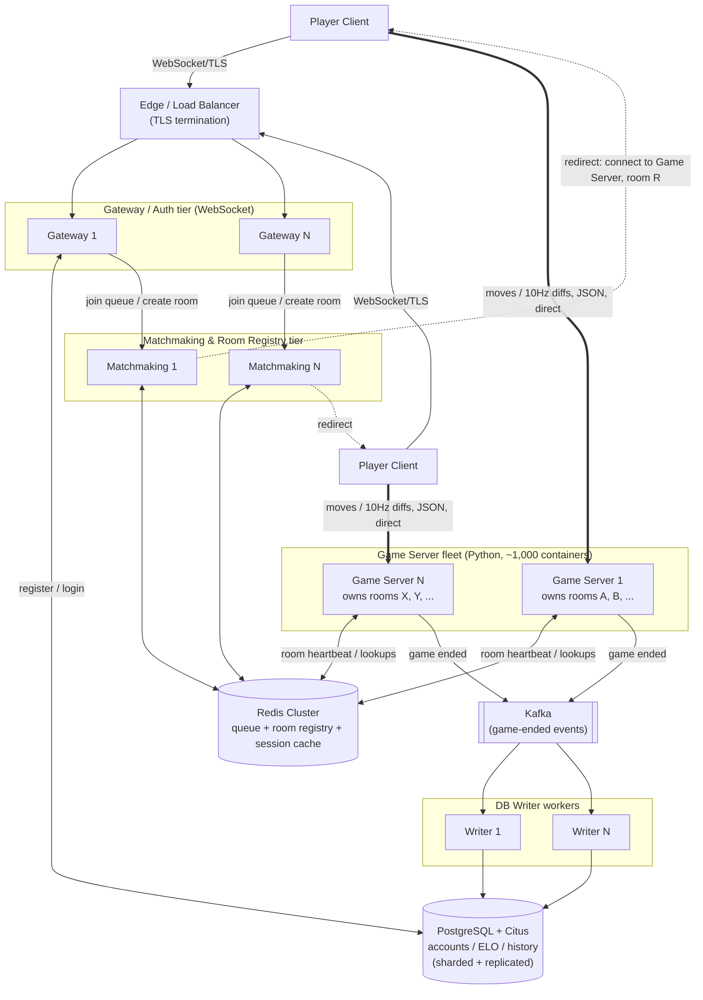

# Kung Fu Chess — Server Architecture

This is the decided architecture — every open question has been resolved to one concrete
choice. Each section below states the decision and explains why, grounded in real
calculations against the target scale, not a menu of alternatives anymore.

**Target scale:** 100,000,000 registered accounts, 10,000,000 concurrent players
worldwide, real-time gameplay, average game length 30–90 seconds. One process per Docker
container; the database counts as one logical server even though it's a cluster
internally.

**Grounded in the actual game logic:** a game is exactly two players in one room
(`server/services/room_service.py`'s `RoomService`); matching by rating is a queue +
pairing problem (`server/services/matchmaking_service.py`'s ELO-windowed queue); the game
itself is a real-time simulation with its own clock, not request/response
(`engine.game.GameEngine` + `server.game.real_time_arbiter.RealTimeArbiter`, ticking
every 30 ms, `TICK_INTERVAL_S = 0.03`); accounts/ELO already live in a real relational
schema (`server/database/sqlite_db_manager.py`), today backed by SQLite. Because a room's
simulation is single-process by construction, **the natural unit of horizontal scaling is
the room**, not the player — every decision below follows from that.

---

## Architecture decisions

### 1. Database: PostgreSQL + Citus

SQLite is ruled out first, regardless of what replaces it: it's single-writer/single-file
with no network protocol at all, and the write rate the target scale implies is far
beyond a single writer. Using Little's Law on the given numbers: 5,000,000 concurrent
games (10M players ÷ 2) at a 60-second average lifetime →
```
5,000,000 ÷ 60s ≈ 83,333 game completions/second
```
Each completed game needs a `game_history` insert + ELO updates — call it 3 writes/game:
```
83,333 × 3 ≈ 250,000 write operations/second, sustained, cluster-wide
```
That number rules out SQLite outright (storage isn't the issue — 100M accounts is only
~30 GB — the single-writer lock is).

**Chosen: PostgreSQL, sharded with Citus.** Standard SQL, the same query surface
`server/database/sqlite_db_manager.py` already uses, a huge operational ecosystem, and
Citus adds horizontal write-sharding (partitioned by `user_id`) so the 250,000 writes/sec
and 30 GB of account data spread across many shards instead of one writer. (The
alternative distributed-SQL options — CockroachDB, YugabyteDB — would also clear this bar;
Citus was chosen for staying closest to plain Postgres rather than adopting a newer,
less-established distributed database.) From every other tier's point of view this is
still **one logical endpoint**, per the target-scale assumption.

### 2. Routing: direct redirect to the Game Server

Once two players are matched, their room lives on exactly one Game Server — rooms can't
be split across processes, since `RealTimeArbiter` owning one `GameEngine` is the whole
point.

**Chosen: direct redirect.** Matchmaking tells both clients "connect to Game Server G,
room R"; they open a new connection straight to it, rather than having traffic proxied
through the Gateway. This matters because of the bandwidth numbers in decision 4 below —
proxying would double every byte of move/snapshot traffic, and outbound state traffic is
already the dominant cost in this design. The tradeoff accepted: client code needs a
reconnect step after being matched, instead of one connection for the whole session.

### 3. Game-end persistence: Message Bus (Kafka) + DB Writer workers

The database only needs to be touched at the edges of a game's life (arguably not at
room creation at all; at minimum once at game end) — never mid-game. That keeps the
250,000 writes/second from decision 1 off the real-time hot path entirely, *if* it's
routed asynchronously.

**Chosen: Game Server publishes a small "game ended" event to Kafka and moves on
immediately; a horizontally-scaled pool of DB Writer workers consumes the topic and
performs the actual insert/update against the Postgres+Citus cluster.** Kafka was chosen
over Redis Streams or RabbitMQ for its higher sustained-throughput ceiling and replayable,
partitioned log — a good match for a steady ~83,000 events/second with room to spike. The
alternative (a Game Server writing to the DB synchronously at game-end) was rejected
because a slow write would then block that container's real-time tick loop, and the DB
cluster would need to be provisioned to absorb the full write burst directly rather than
having it smoothed by a worker pool.

### 4. State broadcast: decoupled 10 Hz + diffs

The current implementation broadcasts a **full board snapshot every simulation tick**
(30 ms / 33.3 Hz) to both players, regardless of whether anything moved
(`_RoomBroadcastObserver` fires on every engine event; `tick()` always fires a
`TimeAdvancedEvent`). At target scale:
```
5,000,000 rooms × 33.3 broadcasts/s × 2 recipients = 333,333,333 messages/second
333,333,333 × ~500 B ≈ 166.7 GB/s ≈ 1.3 Tbps, cluster-wide
≈ 1.3 Gbps, per single Game Server container (at ~5,000 rooms/container)
```
That would be the dominant cost and first bottleneck in this whole design.

**Chosen: decouple the network broadcast rate from the simulation tick.** The simulation
still runs at 30 ms (that precision is what makes cooldowns and mid-flight collisions
correct), but the server broadcasts to clients at **10 Hz** and sends only the cells that
changed since the last broadcast, not the whole board:
```
≈3.3x reduction (33.3Hz -> 10Hz) x ≈4x reduction (full board -> diff) ≈ 13x
1.3 Tbps ÷ 13 ≈ 100 Gbps, cluster-wide
≈ 100 Mbps, per Game Server container
```
That's within what a single container's network interface and a datacenter fabric handle
routinely — the same order of magnitude commercial real-time multiplayer platforms run at.

### 5. Client ↔ Gateway protocol: WebSocket

**Chosen: WebSocket** for the auth/matchmaking leg (client ↔ Gateway) — the same choice
this repo's older `server/server.py` already made. It passes through standard
HTTP-aware load balancers and CDNs without special handling, which matters for a
tier that's directly internet-facing and needs to sit behind the Edge/LB tier and any
CDN/WAF in front of it. Kept deliberately different from decision 6 below — the
Gateway leg is low-frequency (login, matchmaking requests), so ease of infrastructure
integration wins over the raw framing efficiency that matters for the high-frequency leg.

### 6. Client ↔ Game Server protocol encoding: JSON

**Chosen: keep JSON**, over this repo's existing framed protocol
(`shared/protocol`: 4-byte length header + one dataclass per message type, already
implemented and tested). This is the higher-frequency leg (moves in, state diffs out,
after decision 4's optimization), so message size matters more here than on the Gateway
leg — but JSON was kept rather than moving to a binary encoding (e.g. Protocol Buffers)
because decision 4 already delivers the order-of-magnitude bandwidth reduction that
matters (1.3 Tbps → ~100 Gbps); a binary encoding would shrink the remaining ~100 Gbps
further but adds a schema/codegen dependency this project doesn't have today. Worth
revisiting once §4's optimization is actually built and measured, not before.

### 7. Game Server runtime: keep the current Python implementation

**Chosen: no rewrite.** `RealTimeArbiter`/`GameEngine` stay exactly as they are — a
single-process, GIL-bound, 30 ms real-time loop. Capacity planning is sized around a
conservative **~10,000 concurrent players (~5,000 rooms) per container** before tick-loop
CPU jitter becomes a concern, which is the number decision 4's per-container bandwidth
figures and the server-type sizing table below are built from. The tradeoff accepted: at
10,000,000 concurrent players, that means **~1,000 Game Server containers**, rather than
fewer, larger ones a more concurrency-friendly runtime might allow. The architecture
scales the same way either way (add containers) — this decision only affects how many.

### 8. Geographic sharding: 3 regional clusters, same-region-first matchmaking

Every decision above assumes one logical cluster. That's wrong for reasons bandwidth
alone doesn't capture — **propagation delay**, not throughput, is the limiting factor
once players are spread across continents, and no amount of horizontal scaling fixes it:
light in fiber travels at ≈2×10⁸ m/s (≈2/3 c, from the ≈1.47 refractive index of
single-mode fiber), and real cable routes run 1.3–1.5× longer than the great-circle
distance. For four representative pairings:

```
Same metro area (~500 km):        one-way ≈ 2.5ms  -> RTT ≈ 5-15ms  (with routing overhead)
US East <-> Western Europe (~6,500 km fiber path): one-way ≈ 32.5ms -> RTT ≈ 70-80ms
US West <-> East Asia (~10,000 km fiber path):     one-way ≈ 50ms   -> RTT ≈ 100-120ms
Near-antipodal (e.g. US East <-> India, ~16,000 km): one-way ≈ 80ms -> RTT ≈ 180-250ms
```

Compare those RTTs to the mechanics they'd be feeding: `MOVE_DURATION` (200ms per
checkpoint) and the 10Hz/100ms broadcast interval from decision 4. Once one-way latency
approaches or exceeds ~100ms (true for every trans-oceanic pairing above), a player's move
command can arrive at the Game Server a full checkpoint — or more — after they clicked,
purely from physics, before the server does any processing at all. Because `tick()`
resolves the earliest-due checkpoint first (`engine/game.py`'s own documented tie-break),
the lower-latency player in any cross-continent match has a structural, physics-based
advantage in every contested-square race — not a bug in the engine, an inherent property
of real-time client-server games, fixable only by keeping the two players (and the Game
Server simulating their match) physically close.

**Chosen: 3 regional clusters — Americas, Europe, Asia-Pacific — each a full, independent
copy of the stack in the table below (Edge, Gateway, Matchmaking+Redis, Game Servers,
Kafka, DB Writers), fronted by GeoDNS routing each client to its nearest region.**
Matchmaking is **same-region-first**: it only ever pairs players against its own region's
queue by default. This is the same ELO-window-widening algorithm
`MatchmakingService.find_match` already implements (accepted rating gap grows with wait
time) — extended with a second, independent widening dimension: only after a wait
threshold (e.g. 3s) does a region's Matchmaking instance also query a neighboring region's
Matchmaking API directly for a compatible waiting player, as an explicit, deliberately
rare exception path — **not** full cross-region Redis replication, since the entire point
of this decision is that cross-region matches should almost never happen.

The ~1,000-container Game Server total from decision 7 is a global sum, split
proportionally to expected regional demand (illustrative 40/30/30 split):

| Region | Share | Concurrent players | Game Servers | Gateways | Matchmaking | Kafka brokers | DB Writers |
|---|---|---|---|---|---|---|---|
| Americas | 40% | 4,000,000 | 400 | 80 | 40 | 12 | 20 |
| Europe | 30% | 3,000,000 | 300 | 60 | 30 | 9 | 15 |
| Asia-Pacific | 30% | 3,000,000 | 300 | 60 | 30 | 9 | 15 |
| **Total** | | **10,000,000** | **1,000** | **200** | **100** | **30** | **50** |

**Database stays one logical PostgreSQL+Citus cluster** (per the target-scale assumption)
rather than being sharded by region — with a **read replica in each region** for
low-latency auth/profile reads, while writes (registration, and ELO/history via Kafka)
go to the single primary region. This is safe specifically because: registration/login
are rare, one-off actions where an extra ~100–200ms write latency to a remote primary is
imperceptible, and ELO/history writes are already fully decoupled from the real-time hot
path by decision 3 — a region's own Kafka cluster and DB Writer pool simply write to the
primary region's Postgres+Citus over the private inter-region backbone, at whatever
latency that takes, without touching gameplay at all.

**Tradeoff accepted:** 3× the infrastructure footprint and a genuinely harder
multi-region operations story (cross-region DB replica lag, GeoDNS health checks, a
region-outage runbook), in exchange for bounding the vast majority of matches to
same-region, low-RTT pairings. A small number of players in a thin region occasionally
wait longer or get a higher-latency cross-region match — accepted as strictly better than
either never matching them or matching everyone globally with unbounded latency.

### 9. Graceful draining: preStop hook + terminationGracePeriodSeconds + PodDisruptionBudget

The existing failure-handling table only covers *crashes*. A routine version rollout is a
*voluntary* disruption — the orchestrator chooses when to stop a container — which means
it can and should wait for in-flight games to finish, unlike a crash.

**Chosen mechanism**, per Game Server container:

1. **preStop hook** — on receiving the termination request, immediately (a) sets
   `gameserver:{id}:status = draining` in Redis, so Matchmaking's least-loaded-selection
   query (`WHERE status != 'draining'`) stops assigning it new rooms, then (b) polls its
   own in-flight room count in a loop (e.g. every 1s) until it reaches zero **or** a
   90-second cap is hit — 90s because that's this project's own stated maximum game
   duration, so no in-progress game is ever cut short by a routine deploy.
2. **`terminationGracePeriodSeconds: 100`** — covers the worst case (a room that just
   started right as draining began, running the full 90s) plus a 10s buffer for the
   process to actually exit cleanly after the preStop hook returns and SIGTERM is sent.
   If the container hasn't exited by then, SIGKILL follows — a deliberate, bounded
   backstop, not the expected path.
3. **`PodDisruptionBudget.maxUnavailable: 5%`** — caps how many containers can be
   draining at once during a *voluntary* disruption (a rolling deploy, or a node drain for
   maintenance happening concurrently). At ~1,000 total Game Servers that's ~50 at a time
   globally (proportionally ~20 in the Americas region, per the table above) — a full
   fleet rollout completes in roughly `1,000 ÷ 50 × 100s ≈ 2,000s ≈ 33 minutes`, or faster
   if deploys are staged one region at a time (recommended, since it also bounds the blast
   radius of a bad release to one region instead of the whole fleet).

This is the same idea decision 7's "≤90s of state loss is cheap to lose" argument already
established for crashes — draining just gets to be zero loss instead of bounded loss,
because a voluntary disruption can afford to wait 90s and a crash can't.

### 10. Room Registry consistency: atomic Redis ops, not read-then-write

With Matchmaking now a horizontally-scaled tier (~30–40 instances per region), two
instances can race on the same shared state. Concretely: two instances both read
"Game Server G has 4,999/5,000 rooms" and both decide to assign a new room to it,
overshooting capacity — a classic check-then-act race, not solvable by adding more
replicas of the same racy logic.

**Chosen: replace read-then-write capacity checks with Redis's own atomic primitives.**

- **Capacity**: `INCR gameserver:{id}:room_count` (atomic in Redis) *first*; only after
  incrementing, check whether the result exceeds `MAX_ROOMS_PER_CONTAINER` (5,000) — if
  so, `DECR` back and retry room selection against a different Game Server. Worst case one
  instance overshoots by exactly 1 for the instant between `INCR` and the correcting
  `DECR`, never leaving the system stuck over capacity, because the check-and-correct is
  unconditional and doesn't depend on winning a race.
- **Assignment**: `SET room:{room_id}:game_server {id} NX` (set-if-not-exists, atomic) —
  the first Matchmaking instance to successfully set it wins the assignment; a second
  instance racing on the same `room_id` (e.g. a retried request after a dropped response)
  gets told the key already exists and reads the existing assignment back instead of
  creating a conflicting second room for the same two players.

Both are preferred over a general-purpose distributed lock (e.g. Redlock) around the
whole "pick least-loaded server" step: the actual critical section is one counter and one
key, small enough that Redis's own atomic commands are sufficient, without a lock's
failure modes (held too long, expiring mid-operation) to reason about.

### 11. Kafka partitioning: by `game_id`, not by `user_id` — because ELO updates are commutative increments

The naive answer — partition by `user_id` so a user's events stay ordered — doesn't
actually work here: a game involves *two* users, and forcing every game both of them ever
play to land in the same partition as each other transitively chains unrelated players
into ever-larger partitions, defeating parallelism entirely.

**Chosen: don't require per-user ordering in the first place.** The Game Server already
knows both players' ratings as of the start of the game it's reporting on (it read them at
matchmaking time), so it computes the standard ELO **deltas** for both players — not their
new absolute ratings — and publishes those deltas in the "game ended" event. The DB Writer
then applies them as
```sql
UPDATE users SET elo_rating = elo_rating + :delta WHERE user_id = :id
```
— an atomic, **commutative** increment at the database layer: however two updates for the
same user are ordered or interleaved across workers, addition gives the same final result
either way, so there's no cross-event ordering requirement left to satisfy. (This requires
changing `UserRepository.update_elo` from its current absolute-set signature to a
delta-increment operation — a concrete, flagged code change, not just infra config.)

With ordering off the table, the topic is partitioned purely for throughput: **128
partitions, keyed by `hash(game_id)`** — comfortably more than the ~50 DB Writer workers
in the table above, leaving headroom to grow the worker pool up to 128 before a
repartition is ever needed. `game_history` inserts have no ordering constraint at all
(independent rows, keyed by `game_id`), so they ride along on the same partitioning with
no extra consideration.

### 12. Data-loss policy on crash: nothing is recorded, and that's the accepted policy

If a Game Server crashes *before* publishing a game's "game ended" event, that game is
gone: no `game_history` row, no ELO change for either player. This is a deliberate policy,
not an unhandled edge case:

- The game's only canonical state ever lived in that one process's memory (per this
  project's own real-time design — nothing mid-game is persisted). There is no partial
  state to recover, and building one would mean persisting at a rate far above the
  already-large 250,000 writes/s *game-end* rate from decision 1 — exactly the cost
  decision 3 exists to avoid.
- Losing an in-progress **casual, 30–90s match** to a rare container crash is treated as
  acceptable, bounded cost — consistent with decision 9's framing that this project's
  games are cheap to lose, not with how a ranked/tournament system would need to treat it.
- **No partial ELO update is possible.** Decision 11 already means both players' deltas
  and the history row travel as fields of one Kafka message — it's either published (after
  the game genuinely ended) or it isn't (crash before publish). On the consuming side, the
  DB Writer wraps its ELO increments *and* the `game_history` insert in a single database
  transaction, so a DB Writer crash mid-processing rolls back cleanly with no partial
  effect — and because the Kafka message isn't acknowledged until that transaction
  commits (already how decision 3's own failure handling works), it's simply redelivered
  and retried whole.
- A lightweight metric — "rooms torn down without a game-ended event" — is emitted by the
  orchestrator/Room-Registry cleanup path purely for observability (confirming the
  crash-loss rate stays small), not for recovery, since there's genuinely nothing to
  recover.

---

## Resulting architecture

### Server types

Instance counts are global totals; per decision 8 every row except Database Cluster is
deployed independently in each of the 3 regions (Americas/Europe/Asia-Pacific), split
40/30/30 — see decision 8's own table for the per-region breakdown.

| # | Server type | Technology | Stateful? | Instances at target scale | Scales with |
|---|---|---|---|---|---|
| 1 | Edge / Load Balancer | Managed L4/L7 LB, GeoDNS/anycast | No | ~10–20, globally distributed | Total connection rate |
| 2 | Gateway / Auth | WebSocket, talks to DB cluster | No (signed session token) | ~200 | Login/connect rate |
| 3 | Matchmaking & Room Registry | Container(s) + Redis Cluster | Compute: no. Registry/queue: yes, in Redis | ~100 compute + Redis cluster (dozens of shards, replicated) | Room create/join rate (~83k/s) |
| 4 | Game Server | Python, one process/container, owns `RealTimeArbiter` per room | **Yes**, per room, for ~30–90s | **~1,000** (10M players ÷ 10,000/container) | Concurrent players/rooms |
| 5 | Kafka (Message Bus) | Kafka, replication factor 3, 128 partitions on the "game ended" topic (decision 11) | Yes (replicated log) | ~30 brokers | Game-end event rate (~83k/s) |
| 6 | DB Writer Worker | Consumes Kafka, writes to DB | No | ~50 | Game-end write rate |
| 7 | Database Cluster | PostgreSQL + Citus, one primary region + a read replica per region (decision 8) | Yes — one logical server | Dozens of shards × replicas | Registered users (100M) + write throughput |

### Role of each server type

- **Edge / Load Balancer** — the only public IP. TLS termination, DDoS absorption,
  stateless routing to a healthy Gateway.
- **Gateway / Auth (WebSocket)** — Register/Login against the DB cluster
  (`AuthService`'s job today, unchanged conceptually), and the entry point for "I want to
  play" requests, forwarded to Matchmaking. Holds no per-player game state.
- **Matchmaking & Room Registry (Redis)** — the *global* view of who's waiting and which
  room lives on which Game Server (the distributed version of this repo's
  `MatchmakingService`/`RoomService` — must be global, or players on different servers
  could never be matched together). Pairs by ELO with the same widening-window algorithm
  already implemented, picks a Game Server for a new room, writes the assignment to the
  registry, and tells both clients where to redirect (decision 2).
- **Game Server fleet (Python)** — the actual product. Each container runs many
  independent `GameEngine`/`RealTimeArbiter` instances, one per assigned room, ticking at
  30 ms, validating/applying moves, broadcasting diffs at 10 Hz (decision 4). Never talks
  to another Game Server — rooms are fully isolated, which is what makes this tier scale
  horizontally without coordination.
- **Kafka** — decouples "a game just ended" from "the DB got updated" (decision 3). A
  Game Server publishes one event per finished game and moves on; never blocks its
  real-time loop on a database round trip.
- **DB Writer Workers** — a small stateless pool consuming Kafka and performing the
  actual `game_history` insert + ELO updates, at whatever rate Postgres+Citus can sustain.
- **Database Cluster (PostgreSQL + Citus)** — durable accounts, credentials, ELO, game
  history. One logical endpoint to everything upstream; sharded/replicated internally.

### Communication



- **Client ↔ Gateway:** WebSocket over TLS (decision 5) — auth/matchmaking traffic only,
  low frequency.
- **Client ↔ Game Server (post-redirect):** a **direct** connection (decision 2), JSON
  over this repo's existing length-prefixed framing (decision 6), carrying moves in and
  10 Hz board diffs out (decision 4).
- **Gateway/Matchmaking ↔ Redis:** the Redis wire protocol (RESP) — low-latency
  key/value and queue operations.
- **Game Server → Kafka → DB Writers → PostgreSQL+Citus:** asynchronous, at game-end
  only (decision 3). The real-time hot path never talks to the database directly.
- All server-to-server traffic stays inside a private network (VPC), mTLS between
  services; only the Edge tier is internet-facing.

### Failure handling

| Server type | If an instance goes down | Recovery |
|---|---|---|
| Edge / LB | Invisible to users | Redundant instances; orchestrator replaces it |
| Gateway / Auth | In-flight requests fail | Stateless — client retries against another instance |
| Matchmaking & Room Registry (compute) | Queued requests on that instance are lost | Client retries; durable state lives in Redis, not this tier |
| Redis Cluster | One shard's primary fails | Automatic failover to a replica (Cluster/Sentinel); worst case an in-flight match is dropped and both players re-queue — cheap, since matchmaking data isn't durable-critical |
| Game Server (crash) | All rooms on that container are lost | Bounded loss (≤90s of casual gameplay per room — decision 7's whole premise; no data recorded at all, per decision 12). Orchestrator replaces the container; affected clients re-queue via Matchmaking. No hot standby needed per room |
| Game Server (routine deploy) | N/A — voluntary, not a failure | Decision 9: preStop hook drains in-flight rooms before exit (zero games lost, not just bounded), `PodDisruptionBudget` caps concurrent draining containers so the rest of the fleet absorbs the load |
| Kafka | A broker fails | Replication factor 3 — no event lost; consumers resume from the last committed offset |
| DB Writer Worker | Crashes mid-processing | Kafka doesn't consider the message acknowledged until the write commits (one transaction per decision 12), so it's redelivered to another worker whole — never a partial ELO update |
| Database Cluster (Postgres+Citus) | One shard's primary fails | Automatic failover to a replica; only that shard's users (~100M ÷ shard-count) briefly affected, not the whole user base |
| A whole region | Region's Edge/Gateway/Matchmaking/Game Servers unreachable | GeoDNS health-checks route new connections to the next-nearest region; in-flight games in the failed region are lost the same way a Game Server crash is (decision 12) — the read replica in that region is unavailable too, but auth/matchmaking simply falls through to a healthy region's replica at the cost of extra latency for that traffic only |

### Why this meets the throughput requirement

- **Inbound moves (~6 Gbps cluster-wide, ~6 Mbps per Game Server container)** — trivial
  for any container's NIC or the datacenter fabric.
- **Outbound state**, thanks to decision 4, is **~100 Gbps cluster-wide / ~100 Mbps per
  container** instead of the naive ~1.3 Tbps — the same order of magnitude commercial
  real-time multiplayer platforms already run at.
- **The database write burst (~250,000 writes/s)**, thanks to decision 3, never reaches
  PostgreSQL+Citus directly — Kafka plus a horizontally-scaled DB Writer pool smooth it
  to whatever rate the shard count was provisioned for.
- **No cross-Game-Server coordination on the hot path.** Each room is owned by exactly
  one process (matching how `RealTimeArbiter`/`GameEngine` already work) — processing a
  move never requires talking to another Game Server, another shard, or the database.
  The only cross-server coordination is matchmaking/room-assignment, at the much lower
  ~83,000/s game-*start* rate against Redis — built for millions of ops/second.
- **Every stateful tier is sharded** — Game Servers by room, PostgreSQL+Citus by user,
  Redis by key — so the system scales by adding shards/containers, never by growing any
  single component without bound.

---

## Part B: Execution plan — repo/service layout

Today, `server/network/server.py`'s `NetworkServer` is one class fusing three
responsibilities that decisions 2–4 and 8–12 above split across four independently
deployable services: raw connection lifecycle, message routing, and Auth/Room/Game
business logic. This section is that split made physical — which folder becomes which
deployable service, what each one keeps from the current codebase untouched, and what has
to change.

### Directory layout

```text
/
├── shared/                     # UNCHANGED -- every service below imports this
│   ├── constants.py
│   ├── models/                 # Color, Cell, PieceType, AbstractBoard/TextBoard
│   └── protocol/                # MessageType, Message dataclasses, Protocol framing
├── core/                       # UNCHANGED -- MoveRequest/PendingMove/GameResult/same_color
├── engine/                     # UNCHANGED -- GameEngine, GameState, rules, rule_engine, ...
├── controllers/, realtime/, input/   # UNCHANGED -- engine's own collaborators
│
├── services/                   # NEW -- one directory per deployable service
│   ├── gateway/
│   │   ├── main.py
│   │   ├── websocket_transport.py     # NEW -- WebSocket accept/session loop (decision 5)
│   │   ├── auth_handlers.py           # = server/services/auth_service.py, unchanged
│   │   └── session_directory.py       # NEW -- Redis lookup: which region/game-server a player belongs to
│   │
│   ├── matchmaking/
│   │   ├── main.py
│   │   ├── room_registry.py           # evolves server/services/room_service.py -- same
│   │   │                               #   RoomStatus/JoinOutcome model, Redis-backed instead
│   │   │                               #   of an in-process dict (flagged code change)
│   │   ├── matchmaking_queue.py       # evolves server/services/matchmaking_service.py --
│   │   │                               #   same ELO-window algorithm, Redis sorted set instead
│   │   │                               #   of an in-process list, + decision 8's region-widening
│   │   └── game_server_selector.py    # NEW -- least-loaded selection + decision 10's atomic
│   │                                   #   INCR/SETNX assignment
│   │
│   ├── game_server/
│   │   ├── main.py                    # ~= server_main.py, narrowed
│   │   ├── network_server.py          # evolves server/network/server.py's NetworkServer --
│   │   │                               #   Auth/Room/Matchmaking handling REMOVED (now
│   │   │                               #   gateway's/matchmaking's job); only room-hosting,
│   │   │                               #   tick, and broadcast remain
│   │   ├── rules/                     # = server/game/rules/*, unchanged
│   │   ├── real_time_arbiter.py       # = server/game/real_time_arbiter.py, unchanged
│   │   ├── move_scheduler.py          # = server/game/move_scheduler.py, unchanged
│   │   ├── collision_service.py       # = server/game/collision_service.py, unchanged
│   │   └── drain.py                   # NEW -- decision 9's preStop drain logic
│   │
│   └── event_consumer/                # the "DB Writer worker" service
│       ├── main.py
│       ├── kafka_consumer.py          # NEW -- topic subscription, partition assignment (decision 11)
│       └── db_writer.py               # evolves server/database/sqlite_db_manager.py's
│                                       #   UserRepository/GameHistoryRepository -- ported to
│                                       #   PostgreSQL+Citus (decision 1); update_elo changed
│                                       #   from absolute-set to delta-increment (decision 11)
│
├── db/                          # NEW -- PostgreSQL+Citus schema/migrations
│   └── migrations/               #   (was: sqlite_db_manager.py's inline CREATE TABLE strings)
│
├── client/, ui/, main.py, main_gui.py, network_client.py,
│  login_view.py, dashboard_view.py    # UNCHANGED -- local/two-player and the older
│                                       #   WebSocket demo path; untouched by this scaling work
└── tests/
    └── services/<name>/         # NEW -- one test suite per new service
```

### What each service inherits vs. what's new

| Service | Inherits as-is | Evolves (same model, new backing store) | New code |
|---|---|---|---|
| `services/gateway/` | `AuthService` (Register/Login flow, bcrypt, ELO field) | — | WebSocket transport loop, Redis session-directory lookups |
| `services/matchmaking/` | `RoomStatus`/`JoinOutcome` enums, the ELO-window widening formula | `RoomService`, `MatchmakingService` — same algorithms, Redis instead of in-process dict/list | Region-widening exception path (decision 8), atomic capacity/assignment ops (decision 10) |
| `services/game_server/` | `server/game/rules/*`, `RealTimeArbiter`, `move_scheduler.py`, `collision_service.py` — all of it, untouched | `server/network/server.py`'s `NetworkServer` — same tick/broadcast loop, with Auth/Room/Matchmaking message handling deleted (moved out) | `drain.py` (decision 9), diff-based 10Hz broadcast (decision 4) |
| `services/event_consumer/` | `GameRecord`/`UserRecord` dataclass shapes | `UserRepository`/`GameHistoryRepository` — same query surface, PostgreSQL+Citus instead of SQLite, `update_elo` becomes a delta increment (decision 11) | Kafka consumer/partition handling |

`shared/`, `core/`, and `engine/` are the one dependency every service above imports and
none of them own — exactly the layering this project already enforces (`engine/`,
`core/`, `shared/` never import from `server/`), which is precisely what makes this split
possible without restructuring the domain logic itself.
